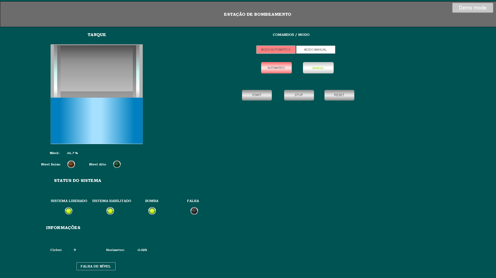
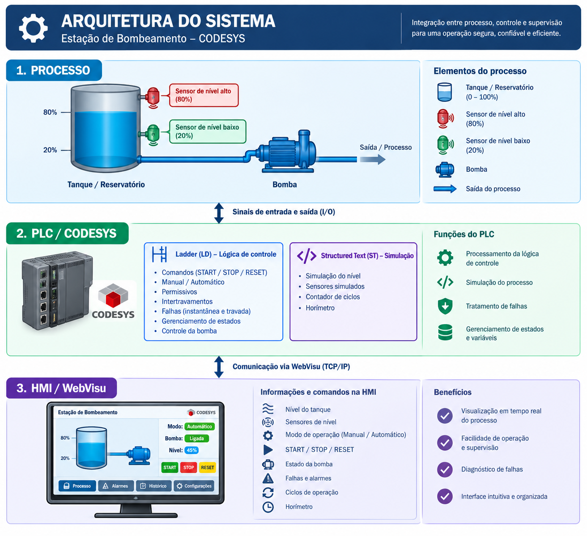
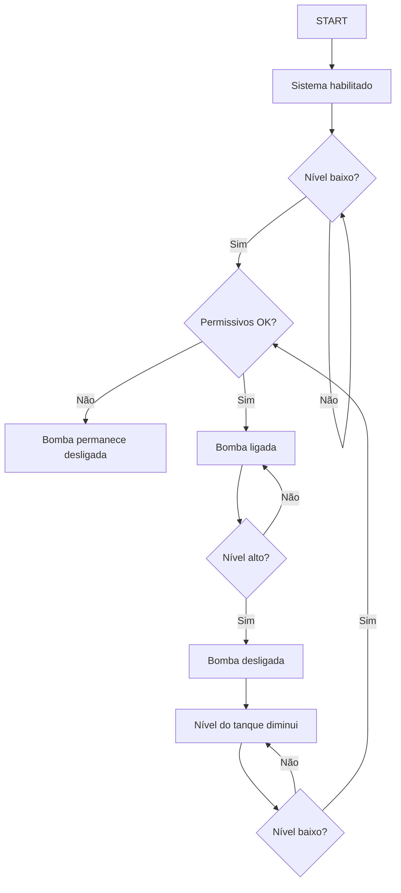
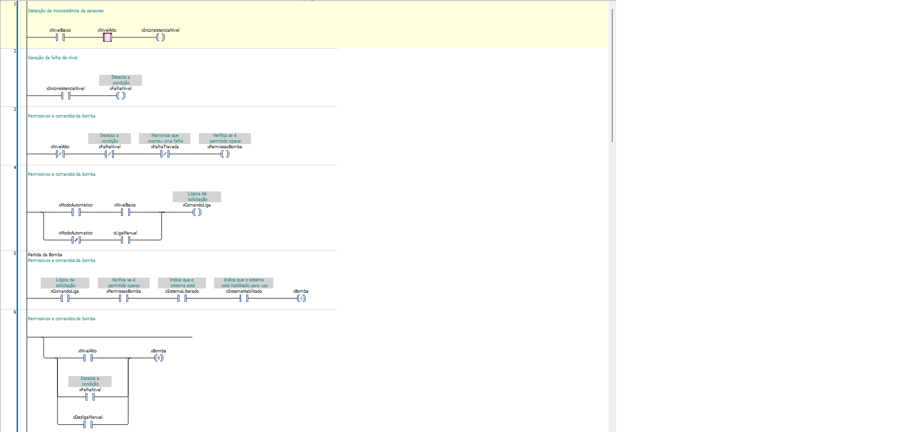
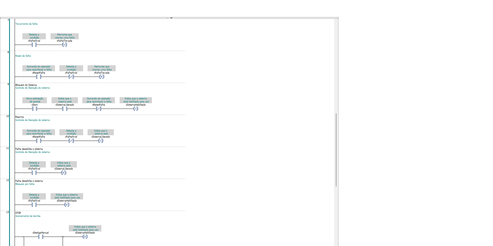
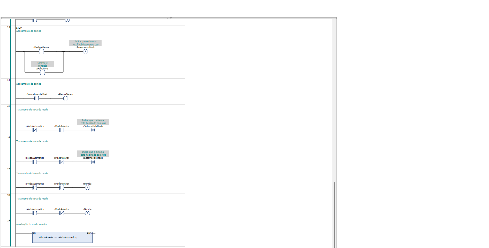

# Estação de Bombeamento Industrial — CODESYS + HMI



Sistema de controle, supervisão e simulação de uma estação de bombeamento industrial desenvolvido no ambiente CODESYS.

O projeto utiliza Ladder Logic para implementação da lógica de controle e Structured Text para simulação do processo, com supervisão e operação através de uma interface WebVisu.

## 📋 Sobre o projeto

O sistema simula uma estação de bombeamento responsável pelo controle do nível de um tanque.

A aplicação possui:

- Operação automática e manual;
- Comandos de START, STOP e RESET;
- Controle de uma bomba;
- Sensores de nível baixo e alto;
- Permissivos e intertravamentos de processo;
- Detecção de inconsistência entre sensores;
- Retenção de falhas;
- Bloqueio de partida após falha;
- Simulação do nível do tanque;
- Contador de ciclos da bomba;
- Horímetro de funcionamento;
- Interface HMI desenvolvida com WebVisu.

## 🎯 Objetivo

Desenvolver e validar uma lógica de controle PLC para uma estação de bombeamento industrial, utilizando CODESYS, com foco em:

- Controle de processo;
- Lógica Ladder;
- Operação manual e automática;
- Intertravamentos;
- Tratamento de falhas;
- Supervisão através de HMI;
- Simulação de processo sem necessidade de hardware físico.

## 🛠️ Tecnologias utilizadas

- CODESYS
- Ladder Logic (LD)
- Structured Text (ST)
- WebVisu
- PLC Runtime
- Simulação de processo

## ▶️ Como executar

### Requisitos

- CODESYS;
- CODESYS Control Win V3 x64;
- Navegador Web;
- Sistema operacional Windows.

### Execução do projeto

1. Abrir o projeto no CODESYS.
2. Selecionar o runtime **CODESYS Control Win V3 x64**.
3. Conectar o ambiente de desenvolvimento ao runtime.
4. Realizar o download da aplicação para o runtime.
5. Executar o programa `PLC_PRG`.
6. Abrir a visualização `VISU_PRINCIPAL`.
7. Acessar a interface WebVisu pelo navegador.
8. Utilizar os comandos START, STOP e RESET para testar o sistema.

### Funcionamento da simulação

Após iniciar o sistema em modo automático, o processo simulado reproduz a variação do nível do tanque.

Quando o nível atinge a condição de nível baixo, o sistema pode solicitar o acionamento da bomba, desde que todos os permissivos estejam satisfeitos.

Com a bomba ligada, o nível do tanque aumenta até atingir a condição de nível alto, provocando o desligamento da bomba.

Após o desligamento, o nível volta a diminuir até atingir novamente a condição de nível baixo, permitindo um novo ciclo.

A interface WebVisu permite acompanhar o comportamento do processo e os estados do sistema durante a execução.

## 📦 Projeto CODESYS

O projeto completo está disponível no arquivo abaixo:

👉 **[Baixar projeto CODESYS](./Estacao-Bombeamento-CODESYS.project)**

O arquivo pode ser aberto diretamente no CODESYS para análise da lógica Ladder, Structured Text e da interface WebVisu.

## 🏗️ Arquitetura do sistema



O sistema foi estruturado em três camadas principais:

### 1. Processo

Representa o processo industrial simulado:

- Tanque;
- Sensor de nível baixo;
- Sensor de nível alto;
- Bomba de transferência.

### 2. Controle — PLC

O CODESYS executa a lógica de controle da estação.

A lógica Ladder é responsável por:

- Gerenciamento dos comandos;
- Operação automática e manual;
- Permissivos de acionamento;
- Intertravamentos;
- Detecção de inconsistência dos sensores;
- Retenção de falhas;
- Controle da bomba;
- Gerenciamento de START, STOP e RESET.

### 3. Supervisão — HMI

A interface WebVisu permite ao operador:

- Visualizar o nível do tanque;
- Visualizar os sensores;
- Selecionar o modo de operação;
- Comandar START, STOP e RESET;
- Acionar a operação manual;
- Visualizar o estado da bomba;
- Visualizar falhas;
- Acompanhar ciclos da bomba;
- Acompanhar o horímetro.

### Fluxo do sistema

```text
PROCESSO
   │
   ├── Nível Baixo
   ├── Nível Alto
   │
   ▼
┌─────────────────────────┐
│      PLC - CODESYS      │
│                         │
│  Ladder Logic           │
│  Permissivos            │
│  Intertravamentos       │
│  Falhas                 │
│  Modos de operação      │
└────────────┬────────────┘
             │
             ▼
          BOMBA
             │
             ▼
      SIMULAÇÃO DO
         PROCESSO

             ▲
             │
      ┌──────┴──────┐
      │   WebVisu   │
      │     HMI     │
      └─────────────┘
```

## ⚙️ Filosofia de controle

O controle da bomba foi desenvolvido separando três conceitos principais:

- **Comando:** existe uma solicitação para a bomba funcionar;
- **Permissão:** as condições de processo permitem o acionamento;
- **Estado do sistema:** o sistema está habilitado para executar o comando.

Essa separação evita que uma simples solicitação de funcionamento seja suficiente para acionar a bomba.

### Operação automática

No modo automático:

1. O operador realiza o START;
2. O sistema é habilitado;
3. O nível do tanque é monitorado;
4. Quando o nível atinge a condição de nível baixo, existe uma solicitação de bombeamento;
5. O PLC verifica os permissivos e intertravamentos;
6. Se todas as condições forem satisfeitas, a bomba é acionada;
7. O nível do tanque aumenta;
8. Ao atingir o nível alto, a bomba é desligada;
9. O nível volta a diminuir;
10. Quando o nível baixo é atingido novamente, um novo ciclo pode ser iniciado.

### Operação manual

No modo manual:

1. O operador realiza o START;
2. O sistema é habilitado;
3. O operador solicita o funcionamento através do comando manual;
4. O PLC verifica os permissivos e intertravamentos;
5. A bomba é acionada somente se as condições de operação forem válidas;
6. O comando STOP pode interromper a operação.

### Permissivos e intertravamentos

A bomba não é acionada somente porque existe um comando de funcionamento.

Antes da partida, o PLC verifica condições como:

- Ausência de nível alto;
- Ausência de falha de nível;
- Ausência de falha retida;
- Sistema liberado;
- Sistema habilitado;
- Comando de funcionamento ativo.

Dessa forma, o comando de partida e a autorização para acionamento são tratados separadamente.

### Tratamento de falhas

Quando os sensores de nível baixo e alto permanecem ativos simultaneamente, o sistema identifica uma inconsistência de nível.

Essa condição gera uma falha que é retida pelo PLC.

O comportamento implementado é:

```text
Falha detectada
      ↓
Bomba desligada
      ↓
Falha retida
      ↓
Condição física corrigida
      ↓
Sistema continua bloqueado
      ↓
RESET
      ↓
Sistema liberado
      ↓
Novo START
      ↓
Sistema habilitado
```

### Fluxo de operação automática

O ciclo automático da estação segue a sequência abaixo:



## 🧪 Testes e validação

O projeto foi submetido a testes funcionais para verificar o comportamento da lógica de controle, dos intertravamentos e do tratamento de falhas.

### Testes realizados

| Teste | Condição aplicada | Resultado esperado | Resultado |
|---|---|---|---|
| Partida manual | START + comando manual | Bomba acionada se permissivos estiverem OK | ✅ Aprovado |
| STOP | STOP durante operação | Bomba desligada | ✅ Aprovado |
| Partida automática | START + nível baixo | Bomba acionada | ✅ Aprovado |
| Nível alto | Nível alto durante operação | Bomba desligada | ✅ Aprovado |
| Falha de sensores | Nível baixo + nível alto simultaneamente | Falha detectada e bomba bloqueada | ✅ Aprovado |
| Retenção de falha | Falha corrigida sem RESET | Sistema permanece bloqueado | ✅ Aprovado |
| RESET | RESET após correção da falha | Falha liberada sem partida automática | ✅ Aprovado |
| Novo START | START após RESET | Sistema volta a ficar habilitado | ✅ Aprovado |
| START + RESET | Comandos simultâneos | Sistema não deve iniciar indevidamente | ✅ Aprovado |
| Mudança Manual → Automático | Alteração de modo durante operação | Sistema trata a transição sem partida indevida | ✅ Aprovado |
| Mudança Automático → Manual | Alteração de modo durante operação | Sistema trata a transição sem manter comando indevido | ✅ Aprovado |
| Simulação do tanque | Bomba ligada/desligada | Nível aumenta/diminui conforme o estado da bomba | ✅ Aprovado |
| Contador de ciclos | Partidas sucessivas da bomba | Contador incrementa uma vez por partida | ✅ Aprovado |
| Horímetro | Bomba em funcionamento | Tempo de operação é acumulado | ✅ Aprovado |

### Exemplo de sequência de falha

Uma das sequências utilizadas para validação foi:

```text
Operação normal
      ↓
Falha de nível detectada
      ↓
Bomba desligada
      ↓
Falha retida
      ↓
Condição de nível corrigida
      ↓
Sistema continua bloqueado
      ↓
RESET
      ↓
Sistema liberado
      ↓
Novo START
      ↓
Operação retomada
```

## 💻 Linguagens e lógica de programação

O projeto utiliza duas linguagens IEC 61131-3 dentro do CODESYS, cada uma aplicada a uma finalidade específica.

### Ladder Logic (LD)

A lógica principal de controle foi desenvolvida em Ladder.

O Ladder foi utilizado para representar de forma visual a lógica típica de controle industrial, facilitando a análise dos estados, permissivos, intertravamentos e comandos.

Entre as funções implementadas estão:

- Controle da bomba;
- START e STOP;
- RESET de falhas;
- Operação manual e automática;
- Permissivos de acionamento;
- Intertravamento por nível alto;
- Detecção de inconsistência dos sensores;
- Retenção de falhas;
- Gerenciamento do estado do sistema;
- Tratamento das transições entre modos.

### Evidência da lógica de controle

A imagem abaixo apresenta parte da lógica Ladder desenvolvida no CODESYS para o controle da estação de bombeamento.

A lógica contempla elementos como:

- gerenciamento dos comandos de operação;
- permissivos para acionamento da bomba;
- intertravamentos de processo;
- tratamento de falhas;
- retenção e reset de falhas;
- gerenciamento dos estados do sistema;
- operação manual e automática.




> **Observação:** a lógica apresentada foi desenvolvida para simular e validar o comportamento do sistema de controle. Em uma aplicação industrial real, os sinais simulados seriam substituídos por entradas e saídas físicas do CLP, sensores e atuadores.

### Structured Text (ST)

O Structured Text foi utilizado na camada de simulação do processo.

A simulação permite reproduzir o comportamento do tanque sem a utilização de sensores e atuadores físicos.

A lógica de simulação é responsável por:

- Aumentar o nível do tanque quando a bomba está ligada;
- Reduzir o nível quando a bomba está desligada;
- Limitar o nível entre 0% e 100%;
- Gerar automaticamente as condições de nível baixo e alto;
- Contabilizar os ciclos da bomba;
- Acumular o tempo de funcionamento da bomba.

### Por que utilizar duas linguagens?

A utilização das duas linguagens permitiu separar claramente o controle industrial da simulação do processo.

```text
Ladder Logic
     │
     ├── Controle
     ├── Permissivos
     ├── Intertravamentos
     └── Falhas
     
Structured Text
     │
     ├── Simulação do tanque
     ├── Sensores simulados
     ├── Contador de ciclos
     └── Horímetro
```

## 🧠 Competências demonstradas

Este projeto demonstra conhecimentos práticos em:

- Programação de CLP utilizando IEC 61131-3;
- Desenvolvimento de lógica Ladder;
- Programação em Structured Text;
- Operação manual e automática;
- Desenvolvimento de permissivos e intertravamentos;
- Tratamento e retenção de falhas;
- Controle de estados do sistema;
- Simulação de processo industrial;
- Desenvolvimento de interface HMI/WebVisu;
- Testes funcionais e validação da lógica de controle;
- Documentação técnica de sistemas de automação.

## 📁 Estrutura do projeto

```text
Estacao-Bombeamento-CODESYS/
│
├── docs/
│   ├── arquitetura.md
│   ├── filosofia-de-controle.md
│   └── testes.md
│
├── imagens/
│   ├── ihm-principal.png
│   ├── ladder-controle.png
│   └── arquitetura.png
│
└── README.md
```

## ⚠️ Limitações do projeto

Este projeto foi desenvolvido como uma simulação para estudo, validação da lógica de controle e demonstração das funcionalidades do CODESYS.

Os sensores e atuadores utilizados no processo são simulados por software e não representam I/O físicos de uma instalação industrial real.

A aplicação não contempla dispositivos de segurança certificados, como relés de segurança, cortinas de luz, parada de emergência ou arquitetura de Safety PLC.

Em uma aplicação industrial real, esses elementos seriam definidos de acordo com a análise de riscos, requisitos da máquina e normas aplicáveis.

## 🚀 Possíveis evoluções

Como evolução do projeto, poderiam ser implementados:

- Integração com I/O físicos;
- Sensores de nível reais;
- Acionamento da bomba por inversor de frequência;
- Comunicação com dispositivos industriais;
- Histórico de alarmes e eventos;
- Registro de variáveis de processo;
- Integração com banco de dados;
- Implementação de dispositivos e funções de segurança conforme análise de riscos;
- Integração com uma arquitetura SCADA industrial.
